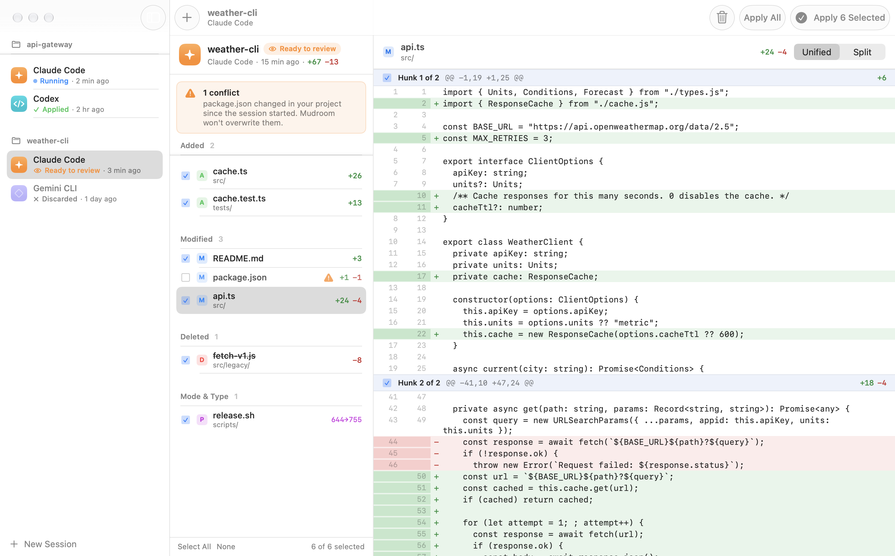
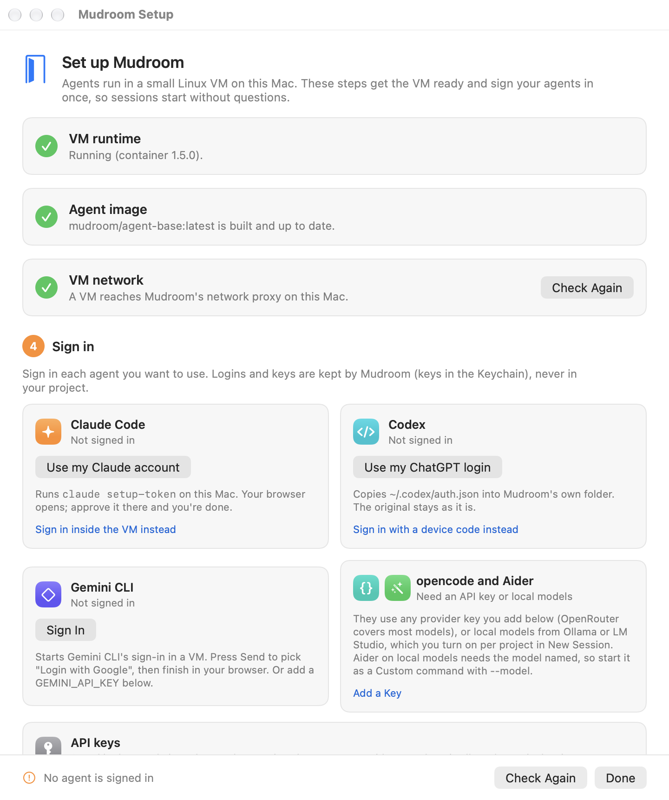
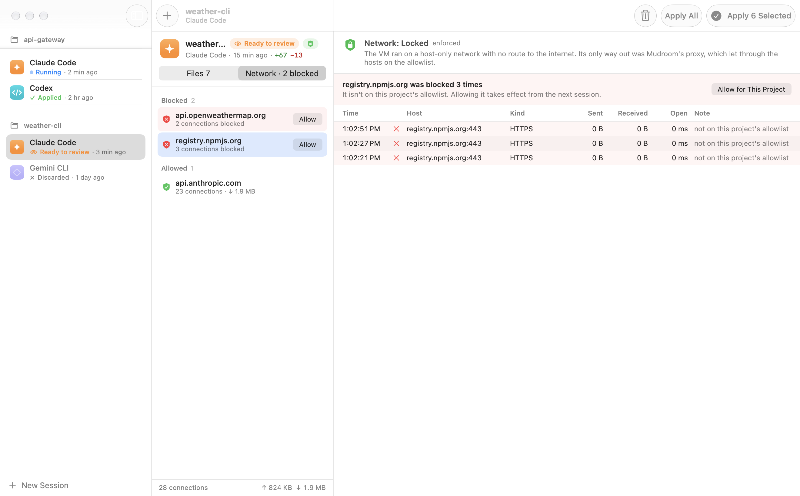
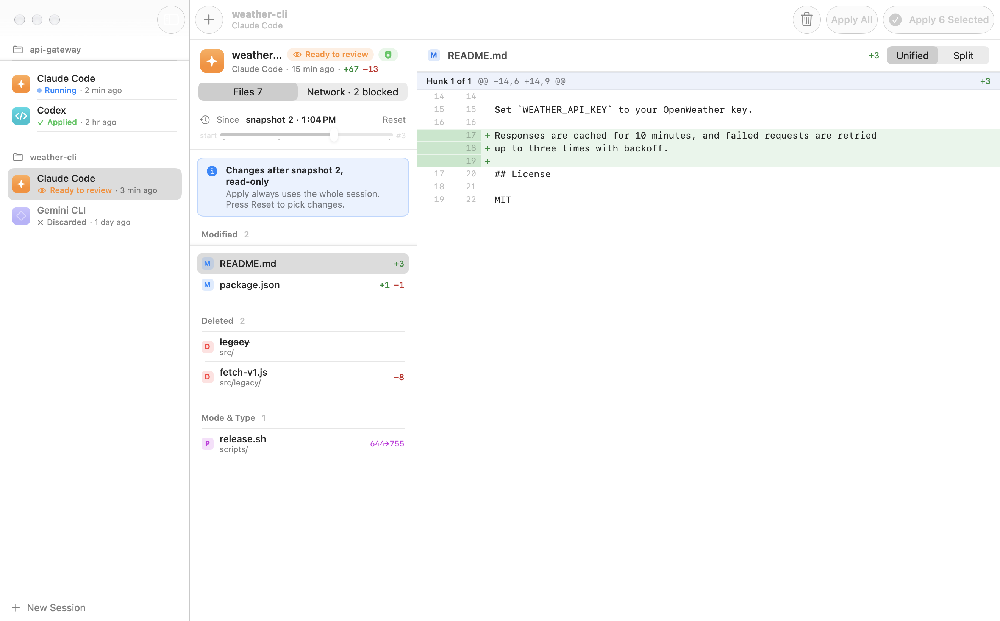
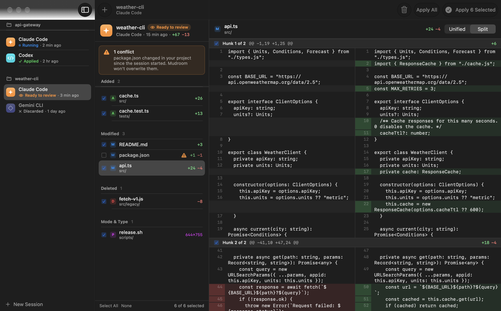
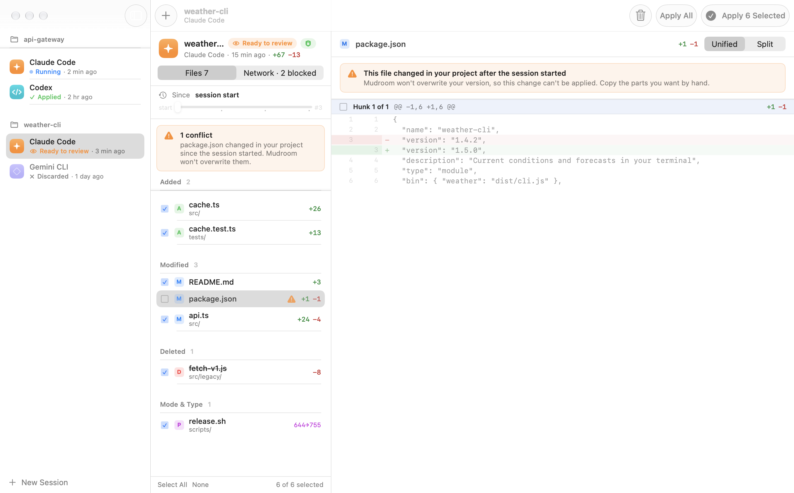
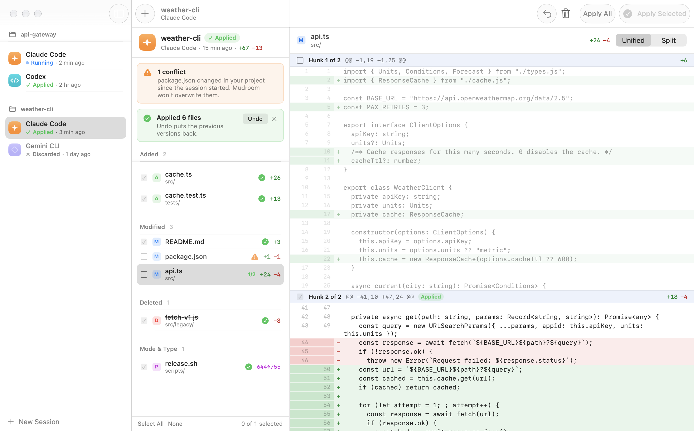
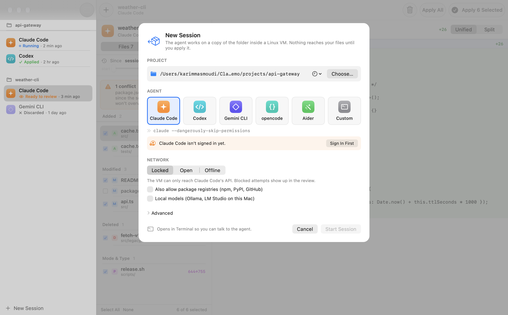

# Mudroom

A pull-request gate for local coding agents, for macOS and Linux.

Mudroom runs Claude Code, Codex, Gemini CLI, opencode, Aider (or any command) in a sandbox, on
a copy of your project: a Linux micro-VM on Apple-silicon Macs, or a Docker
or Podman container elsewhere. Your real folder is never mounted. The
sandbox can only reach the hosts you allow. When the agent is done you read the
diff, then apply all of it, some files, some hunks, or none. Every apply can
be undone.

> Status: early prototype. Expect rough edges and breaking changes.



## Quick start

1. Install Mudroom (Apple-silicon Mac, macOS 26 or later):

   ```sh
   curl -fsSL https://raw.githubusercontent.com/Kernel-Hunter/mudroom/main/install.sh | sh
   ```

2. Open Mudroom. The Setup window opens on the first launch. Click through it:
   - **VM runtime**: Install (runs `brew install container`) and Start. The
     first start downloads Apple's recommended Linux kernel without asking.
   - **Agent image**: Build. It takes a few minutes the first time and shows
     its progress. A network check runs right after.
   - **Sign in**: "Use my Claude account" opens your browser; approve there
     and you're done. Codex and Gemini CLI can reuse the login you already
     have on this Mac. For opencode and Aider, paste an API key (OpenRouter
     works for most models).

3. Click New Session, pick a folder and an agent, and Start.

Setup stays out of the way once everything is green. It's always under
Mudroom > Setup, and the sidebar says so when a step needs attention. On the
command line, `mudroom setup` does the same steps.



## Platforms

| Platform | What you get | Sandbox backend |
|---|---|---|
| macOS 26+, Apple silicon | App and CLI | `apple` (Apple's `container`, one VM per session), or `docker`/`podman` |
| macOS 26, Intel | CLI only (build from source) | `docker` or `podman` |
| Linux x86_64 and arm64 | CLI only (build from source) | `docker` or `podman` |
| Windows | Not yet. WSL2 might work like Linux, but it is untested. | |

The CLI picks a backend with `--backend apple|docker|podman|auto` (or
`MUDROOM_BACKEND`). `auto`, the default, uses Apple's `container` on an
Apple-silicon Mac with macOS 26+ where it is installed, otherwise Docker,
otherwise Podman. A session remembers its backend, so `mudroom start` uses
the same one again. The review app is macOS only. Everywhere else,
`mudroom review <session>` is a basic terminal review screen (toggle files,
read diffs, apply the selection), next to `mudroom diff`, `hunks` and
`apply`. A fuller terminal review UI for Linux, with per-hunk selection and
the network log, is planned.

See [Docker and Podman](#docker-and-podman) for how isolation differs from
the VM backend.

## Install

The app and the install script need macOS 26 or later on Apple silicon. On
Linux and Intel Macs, [build the CLI from source](#build-from-source).

```sh
curl -fsSL https://raw.githubusercontent.com/Kernel-Hunter/mudroom/main/install.sh | sh
```

The script downloads the latest release, checks its SHA-256, puts
Mudroom.app in /Applications (or ~/Applications if /Applications isn't
writable) and links the `mudroom` command into /opt/homebrew/bin,
/usr/local/bin or ~/.local/bin. It doesn't use sudo. Set
`MUDROOM_VERSION=0.1.0` to pick a version. To remove Mudroom again (your
sessions and settings stay):

```sh
curl -fsSL https://raw.githubusercontent.com/Kernel-Hunter/mudroom/main/install.sh | sh -s -- --uninstall
```

Or with Homebrew, which also installs Apple's `container` CLI:

```sh
brew install --cask kernel-hunter/tap/mudroom
```

Mudroom isn't notarized. The install script and the Homebrew cask remove the
quarantine flag, so macOS won't block it. If you download the zip in a
browser, use System Settings > Privacy & Security > Open Anyway, or run
`xattr -dr com.apple.quarantine /Applications/Mudroom.app`.

Then open the app and follow Setup, or run it from a terminal:

```sh
mudroom setup                   # runtime, agent image, VM network, sign-in; asks before each fix
mudroom setup --yes --no-sign-in   # unattended: install, start, build, repair, then stop
```

By hand, the same steps are `brew install container`, `container system start
--enable-kernel-install`, `mudroom image build` (Node LTS, git, ripgrep,
Claude Code, Codex, Gemini CLI, opencode and Aider) and `mudroom agent login
claude`.

Mudroom needs Apple's [`container`](https://github.com/apple/container) CLI
1.5 or later. Earlier versions may lack host-only networks; see
[Network](#network).

### Build from source

You need Xcode 26+ (Swift 6.2+).

```sh
git clone https://github.com/Kernel-Hunter/mudroom
cd mudroom
scripts/build-app.sh            # build/Mudroom.app (app + bundled CLI), ad-hoc signed
open build/Mudroom.app
```

For the command line only (macOS or Linux):

```sh
swift build -c release
cp .build/release/mudroom /usr/local/bin/   # or anywhere on your PATH
```

On Linux you need Swift 6.2 or later ([swift.org/install](https://www.swift.org/install/)),
plus Docker Engine or Podman. Then build the agent image once:

```sh
mudroom image build --backend docker      # or --backend podman
mudroom network check --backend docker    # see what the sandbox can reach
```

## Why

Agents in "skip permissions" mode are fast, and every so often they delete
something they shouldn't, or reach somewhere they shouldn't. There are good
tools for parts of this:

- Apple's `sandboxy` example runs the agent in a VM, but shares your project
  folder into it live (virtio-fs), so every write lands in your real files as
  it happens.
- Docker Sandboxes (`sbx`) mounts the folder read-write by default. Its
  `--clone` mode is closer to Mudroom: the repo is mounted read-only, the
  agent works on a private git clone, and you `git fetch` the result and
  review it with your usual git tools.
- ArcBox mounts nothing: `/workspace` starts empty and you copy files in and
  out yourself.
- vibe-kanban runs agents on git worktrees and gives you a diff review and
  merge step, without a VM.

Mudroom puts these pieces together in one place:

- The agent runs in a VM (or a container, see [Platforms](#platforms)), in
  skip-permissions mode.
- It works on a copy-on-write clone of the **whole folder** (APFS on macOS,
  a reflink on btrfs or XFS, a plain copy elsewhere), including untracked,
  ignored and non-git files. It's not a git clone or worktree, and on APFS
  it takes no extra disk until files change.
- The real folder is never mounted.
- The sandbox sits on a host-only network. Its only way out is a proxy that
  allows the agent's API plus hosts you add, and logs everything it sees.
- When the agent is done you get a native review screen on macOS: per-file and
  per-hunk apply, including deletions, permission bits and symlinks.
- Apply refuses any file you changed yourself in the meantime, and every
  apply can be undone.
- Snapshots taken while the agent runs let you see what it did after a given
  point.

## The app

- **Sidebar**: sessions grouped by project, each with its agent, time and
  status (running, ready to review, applied, discarded).
- **New Session** (⌘N): pick a folder, an agent (Claude Code, Codex, Gemini
  CLI or a custom command) and a network mode (Locked, Open, Offline), then
  start. Mudroom clones the folder and opens the agent in a new Terminal
  window.
- **Review, Files**: changed files grouped into Added, Modified, Deleted and
  Mode & Type, each with a checkbox. The right pane shows a unified or
  side-by-side diff with line numbers. Modified text files have a checkbox per
  hunk, so you can take some edits and leave others.
- **Review, Network**: every host the VM tried to reach, blocked ones first,
  with bytes and connection counts. **Allow** adds a blocked host to the
  project's allowlist for the next session.
- **Timeline**: if the session has snapshots, a slider picks a point in time
  and the file list shows only what changed after it (read-only).
- **Conflicts**: files you changed yourself since the session started are
  flagged in the list and above the diff, and are never overwritten.
- **Apply Selected** (⌘↩), **Apply All** (⇧⌘↩), **Undo** (⌥⌘Z) and
  **Discard** (⌘⌫). One click is one rollback bundle, so one Undo reverts it.
  Space toggles the selected file.

| | |
|---|---|
|  |  |
|  |  |
|  |  |

Why Terminal: agents are interactive terminal programs and you often need to
answer them. Terminal.app gives you scrollback, copy/paste and resizing
without Mudroom shipping a terminal emulator. The app writes a small
`run.command` into the session folder that runs `mudroom start <id>` in a
login shell (so `PATH` and API keys match your usual shell), and it follows
progress by polling `session.json`, which `mudroom start` keeps up to date.
An embedded terminal may come later.

## Command line

```sh
# Start a session: clone the project, boot a VM, run the agent on the clone.
export ANTHROPIC_API_KEY=...    # passed through only if set
mudroom run ~/code/myapp -- claude --dangerously-skip-permissions

# Review.
mudroom review last             # terminal review: space toggles, enter shows the diff, x applies
mudroom diff last --stat
mudroom diff last
mudroom network log last        # what the VM connected to, and what was blocked

# Apply everything, only some paths, or only some hunks of one file.
mudroom apply last --all
mudroom apply last src/parser.swift docs/
mudroom hunks last src/parser.swift            # numbered hunks
mudroom apply last src/parser.swift --hunks 1,3

# Changed your mind.
mudroom undo last

# Snapshots taken while the agent ran.
mudroom snapshots last
mudroom diff last --from 2 --to work           # what changed after snapshot 2
mudroom diff last --from 1 --to 3

# Housekeeping.
mudroom list
mudroom discard <session>       # deletes the session's clones, never the project

# Two-step start (what the app does).
mudroom new ~/code/myapp --agent "Claude Code" -- claude --dangerously-skip-permissions
mudroom start <session>
```

Sessions can be named by full id, a unique prefix, or `last`. `run` and
`start` also take `--network locked|open|offline`, `--allow <host>` (this run
only), `--snapshot-every <minutes>`, `--backend apple|docker|podman|auto`
and, for Docker and Podman, `--oci-runtime <name>` (for example `runsc`).

### Network settings

```sh
mudroom network show                          # mode and allowlist for the current directory
mudroom network allow registry.npmjs.org '*.githubusercontent.com'
mudroom network allow pypi.org --session last # the project of a session
mudroom network deny registry.npmjs.org
mudroom network registries on                 # npm, PyPI and GitHub in one go
mudroom network mode offline
mudroom network check                         # boot a VM and try to get out (see below)
```

Settings are per project, in
`~/Library/Application Support/Mudroom/projects/<hash>.json` on macOS and
`~/.local/share/mudroom/projects/<hash>.json` on Linux, outside the project
so the agent can't change them.

### Credentials and logins

Sessions never stop to ask you to sign in. Sign each agent in once, in Setup
or with these commands, and every session after that starts signed in. New
Session points you to Setup when the agent you picked isn't signed in yet.

`ANTHROPIC_API_KEY`, `CLAUDE_CODE_OAUTH_TOKEN`, `OPENAI_API_KEY` and
`GEMINI_API_KEY` are also forwarded into the VM when they are set in your
shell. Everything is passed by name (`container run --env NAME`, `docker run
--env NAME`), so values don't show up in the process list.

**Claude Code: your Claude account.** If the `claude` CLI is installed on your
Mac (Mudroom looks in `~/.local/bin`, `/opt/homebrew/bin`, `/usr/local/bin`
and your login shell's PATH), "Use my Claude account" in Setup, or `mudroom
agent login claude`, runs `claude setup-token` in a terminal of its own.
Claude opens your browser; once you approve, Mudroom reads the long-lived
token from Claude's output and stores it. You never see or copy it, and it is
hidden from the output Mudroom shows. If the page shows a code instead,
paste it into the field in Setup (or the terminal).

```sh
mudroom agent login claude      # the same from a terminal
mudroom agent token claude      # or paste a token you already have (shown as dots)
mudroom agent token claude --clear
```

The token is kept in the macOS Keychain (service
`io.github.kernel-hunter.mudroom`, written with `SecItemAdd`, never through a
command line). On Linux it goes to `~/.local/share/mudroom/agents/<agent>/token`,
mode 0600. Sessions get it as `CLAUDE_CODE_OAUTH_TOKEN`. Mudroom also marks
Claude Code's first-run screens (theme, the bypass-permissions notice, folder
trust for `/workspace`) as done in its own copy of Claude's settings, so a
session starts straight at the prompt.

**Codex and Gemini CLI: the login you already have.** If `~/.codex/auth.json`
or `~/.gemini/oauth_creds.json` exists, "Use my ChatGPT login" or "Use my
Google login" copies it into Mudroom's agent directory, only when you click.
It is a copy: the original isn't changed or mounted. If you sign in again on
the Mac later, import again.

```sh
mudroom agent import codex
mudroom agent import gemini
```

**Signing in inside a VM.** Without those, the agent signs in inside a VM.
In Setup, the device code (Codex) or the sign-in page (Claude, Gemini) opens
for you, and a visible field takes the code the page gives you.

```sh
mudroom agent login claude --in-vm   # `claude auth login` in the sandbox
mudroom agent login codex       # `codex login --device-auth`
mudroom agent login gemini      # Gemini CLI's sign-in screen, NO_BROWSER mode
mudroom agent status            # signed in / token stored, per agent
```

Copying the sign-in link out of the terminal is fragile: it wraps over several
lines, and losing the end gives errors such as "Invalid
code_challenge_method". Mudroom doesn't rely on that. Each run sets `BROWSER`
in the sandbox to a small script on a mounted folder, so when the agent tries
to open the link, Mudroom gets it on the host. It checks that the link is an
https page on a known sign-in host (claude.ai, claude.com,
platform.claude.com, console.anthropic.com, auth.openai.com, chatgpt.com,
accounts.google.com), opens it in your browser, copies it to the clipboard and
prints it on one line. For Claude Code, whose link points back to a port
inside the sandbox, the redirect is swapped for Claude's own "copy this code"
page; the rest of the request (PKCE challenge, state) is unchanged. After
signing in, paste the code back: in Setup into the code field, in a terminal
where the prompt is (the agent's prompt doesn't echo it).

Each agent gets its own config directory,
`~/Library/Application Support/Mudroom/agents/<agent>/home` (Linux:
`~/.local/share/mudroom/agents/<agent>/home`). Your real `~/.claude` (and the
others) is never mounted. A session doesn't mount this directory either: it
gets a copy, `sessions/<id>/agent-home`, at `/home/node/.claude`,
`/home/node/.codex` or `/home/node/.gemini`. When the session ends, only the
sign-in is copied back (`.credentials.json` and the account fields of
`.claude.json` for Claude Code, `auth.json` for Codex, `oauth_creds.json` and
`google_accounts.json` for Gemini), so a login made in a session sticks, while
settings, hooks or MCP servers a session adds stay in that session.

### API keys

For opencode, Aider, custom commands, or an API key instead of a
subscription, store provider keys with Mudroom. Setup has a field for each;
from a terminal:

```sh
mudroom keys set OPENROUTER_API_KEY   # paste it; shown as dots
mudroom keys                          # names only, never values
mudroom keys remove OPENROUTER_API_KEY
```

Known names: `ANTHROPIC_API_KEY`, `OPENAI_API_KEY`, `GEMINI_API_KEY`,
`OPENROUTER_API_KEY`, `DEEPSEEK_API_KEY`, `GROQ_API_KEY`, `MISTRAL_API_KEY`,
`TOGETHER_API_KEY`, `FIREWORKS_API_KEY`, `XAI_API_KEY`. Any other
upper-case name works too. Keys live in the Keychain (Linux: 0600 files) and
reach sessions by name only.

Claude Code, Codex and Gemini CLI get only their own key. opencode, Aider and
custom commands get all of them, and in locked mode the API host of each
provider whose key is set is allowed automatically: openrouter.ai,
api.deepseek.com, api.groq.com, api.mistral.ai, api.together.xyz,
api.fireworks.ai, api.x.ai (plus api.anthropic.com, api.openai.com and
generativelanguage.googleapis.com). When Claude Code has a sign-in token, a
stored `ANTHROPIC_API_KEY` is left out, so Claude doesn't stop to ask which
one to use.

### Local models (Ollama, LM Studio)

Turn on Local models for a project (New Session, or `mudroom network
local-models on`) and the VM can use Ollama and LM Studio running on your
Mac. They are reached as `http://host.mudroom.internal:11434` (Ollama) and
`http://host.mudroom.internal:1234` (LM Studio) through Mudroom's proxy,
which connects to 127.0.0.1 on those two ports itself. No other port on the
Mac becomes reachable, and nothing else changes about the allowlist.
Sessions get `OLLAMA_HOST`, `OLLAMA_API_BASE` (Aider) and `LM_STUDIO_API_BASE`
pointing there. For example, with the Custom agent:

```sh
aider --yes-always --no-auto-commits --model ollama_chat/qwen2.5:7b-instruct
```

For Aider the model name is enough; it reads `OLLAMA_API_BASE`. opencode
needs the provider in its config, for example an `opencode.json` in the
project:

```json
{
  "provider": {
    "ollama": {
      "npm": "@ai-sdk/openai-compatible",
      "options": { "baseURL": "http://host.mudroom.internal:11434/v1" },
      "models": { "qwen2.5:7b-instruct": { "tools": true } }
    }
  }
}
```

and then `opencode run -m ollama/qwen2.5:7b-instruct "..."` (or pick the model
in opencode). Small models often get tool calls wrong; that is the model, not
the sandbox. Local models need locked mode: open and offline sessions don't
go through the proxy.

### When the VM can't reach the network

A locked session has one way out, Mudroom's proxy on the Mac. Apple's VM
network sometimes gets into a state where the VM can't reach the Mac at all
(`EHOSTUNREACH` to 192.168.128.1) until the container system restarts. Before
every locked session Mudroom boots a tiny VM and checks that it reaches the
proxy (about a second). If it doesn't, the session doesn't start; New Session
and Setup show Repair Network, and in a terminal you're asked:

```sh
mudroom network probe            # check
mudroom network probe --repair   # check, and restart the container system if needed
mudroom setup --repair-network
```

Repair runs `container system stop` and `container system start`, checks
again, and recreates Mudroom's host-only network if that wasn't enough. It
won't run while a Mudroom session is running unless you confirm.

### What `diff` shows

```
M  src/app.swift
A  src/new.swift
D  old/
D  old/notes.txt
P  scripts/build.sh  (mode 644 -> 755)
L  current  (v1 -> v2)
T  config  (file -> symlink)
git metadata changed (12 entries under .git/)
```

Text files get a unified diff from Mudroom's own line diff. Binary files show
`binary changed (size a -> b)` (or `binary added`, `binary deleted`). Changes inside any `.git` directory (also
nested ones, and `.GIT` on case-insensitive disks) are collapsed into one line
unless you pass `--include-git`; `apply` skips them by default for the same
reason.

Some lines get a marker:

```
?  secret.pem  (unreadable: permission denied; not applied)
M  scripts/run  ! setuid/setgid bit, dropped on apply
A  .husky/pre-commit  ! a git hook script that runs on the host
```

`?` is an entry Mudroom couldn't read (permissions, a socket or a FIFO). It is
listed so it isn't silently missing, and it is never applied. Files that your
tools may run on your side, such as `.envrc`, `.gitattributes`,
`.gitmodules`, `.pre-commit-config.yaml`, `.npmrc`, `.vscode/tasks.json` and
scripts under `.husky/` or `.githooks/`, are marked and start unselected in
the review. Aider's own cache and history files (`.aider.tags.cache.v4/`,
`.aider.chat.history.md`) are listed with a `~` note and start unselected
too. setuid and setgid bits are dropped when a file is applied.

Files are compared by content hash, never by timestamp, so an agent can't hide
an edit by resetting mtime. The agent's tree is read through file descriptors
that never follow symlinks and never block on FIFOs, so a swapped path can't
point Mudroom at a file outside the session.

### How apply stays safe

For each path, Mudroom checks that the real project still has exactly what the
session started from. If you edited `README.md` while the agent was working,
`apply` reports a conflict for that file and leaves it alone; the rest still
applies. Other rules:

- Files are written to a temp name and renamed into place.
- Directories are removed with `rmdir`, so a directory that gained a file on
  your side is not deleted.
- Mudroom won't write through a symlinked directory in your project.
- Before touching a file, Mudroom copies it into a rollback bundle in the
  session directory. `undo` restores from there, and skips any path you changed
  again after the apply (`--force` overrides).
- Per-hunk apply uses Mudroom's own line diff (Myers), not `patch`. It
  rebuilds the file from the base version plus the chosen hunks, keeps CRLF
  line endings and a missing final newline as they were, and writes through
  the same checks. A file that already has some hunks from an earlier apply is
  not a conflict; the new hunks are added to it.

- Apply writes what you reviewed. `diff`, `hunks`, `review` and the app
  record the content hash of each file they show you. If the agent's copy
  changed after that, apply refuses that file and asks you to look again.
  Staged copies are hashed again after copying.
- Apply and undo refuse to run while the session's agent is still running,
  checked through a lock the sandbox process holds and by asking the backend.
- Each apply writes a journal before touching anything, so an apply that is
  killed halfway can still be undone. Two applies to the same project wait for
  each other.
- Renames that only change case (`readme.md` to `README.md`) work on
  case-insensitive disks, and file names close to the 255-byte limit work too.

Snapshots don't change this: apply always compares the session's base with
the agent's final copy, whatever point the timeline shows.

## Network

Each project has a mode:

- **Locked** (default). The VM is attached to a host-only network
  (`container network create --internal`, named `mudroom-hostonly`). It has
  no route to the internet and no DNS. `mudroom start` runs a small HTTP
  proxy on the Mac for as long as the agent runs, and the VM gets
  `HTTP_PROXY`/`HTTPS_PROXY` pointing at it. The proxy handles `CONNECT`
  (HTTPS) and plain HTTP, lets through only allowlisted hosts, and writes one
  line per connection (host, port, allowed or blocked, bytes, duration) to
  the session's `network.jsonl`.
- **Open**. Normal outbound access. Nothing is filtered or logged.
- **Offline**. The host-only network with no proxy: no internet at all.

The allowlist is the agent's own hosts plus whatever you add:

| Agent | Default hosts |
|---|---|
| Claude Code | api.anthropic.com, console.anthropic.com, platform.claude.com, claude.ai |
| Codex | api.openai.com, chatgpt.com, auth.openai.com |
| Gemini CLI | generativelanguage.googleapis.com, cloudcode-pa.googleapis.com, oauth2.googleapis.com, www.googleapis.com |
| Package registries (off by default) | registry.npmjs.org, pypi.org, files.pythonhosted.org, github.com, codeload.github.com, *.githubusercontent.com |

Telemetry and error-reporting hosts are left out; Claude Code runs with
`CLAUDE_CODE_DISABLE_NONESSENTIAL_TRAFFIC=1` so it doesn't try them. Patterns
are exact hosts or `*.suffix`, which matches subdomains but not the bare
domain.

The proxy is strict about what it accepts:

- A host must be a plain DNS name (letters, digits, hyphens, dots) or an IP
  literal. Anything else is refused: NUL bytes, `%`, spaces, user info,
  trailing junk, and numeric forms like `0x7f.1` or `2130706433`. The name it
  checks is the name it connects to.
- After DNS, the address is checked too. An allowed name that resolves to a
  loopback, private (10/8, 172.16/12, 192.168/16, fc00::/7), link-local, CGNAT,
  multicast, VM-network or one of the Mac's own addresses is refused, unless
  that exact address is on the allowlist.
- For plain HTTP, the `Host` header is rewritten to the host that was checked.
- A client gets 10 seconds to send its request head (then 408), the head can
  be at most 32 KB (then 400), and at most 256 connections are open at once
  (then 503).

### What the isolation actually does

`mudroom network check` starts a sandbox with a project's settings and tries
to get out. This is its output on macOS 27 with `container` 1.5.0, locked
mode:

```
ok        got through  CONNECT api.anthropic.com:443 via proxy: HTTP/1.1 200 Connection Established
ok        got through  HTTPS GET https://api.anthropic.com/ (proxy variables, if set): HTTP 404
ok        stopped      CONNECT example.com:443 via proxy: HTTP/1.1 403 Forbidden
ok        stopped      HTTPS GET https://example.com/ (proxy variables, if set): Request was cancelled.
ok        stopped      resolve example.com in the sandbox: EAI_AGAIN
ok        stopped      TCP 1.1.1.1:443, ignoring the proxy: timeout
ok        stopped      TCP [2606:4700:4700::1111]:443, ignoring the proxy: ENETUNREACH
ok        stopped      UDP DNS query to 8.8.8.8:53: no reply
note      got through  TCP 192.168.128.1:7000 (the host on the sandbox network; macOS often listens on 7000): connected
```

A program in the VM that ignores the proxy settings, or opens raw sockets,
gets nowhere: no DNS, no route over IPv4, IPv6 or UDP. Offline mode stops
all of these, including the proxy lines; only the last line (the Mac itself)
still gets through. Run the check on your own machine before relying on it.

If your `container` version can't create host-only networks, locked mode
falls back to the normal NAT network with the proxy variables set. The
session is then marked **proxy-enforced (advisory)** in the CLI and the app:
well-behaved tools go through the allowlist, but nothing stops a direct
connection.

## Docker and Podman

With `--backend docker` or `--backend podman` the agent runs in a container
from the same image (`mudroom image build --backend docker` builds it with
`docker build` from the same Containerfile). The session's `work/` clone is
bind-mounted at `/workspace` and the agent's config directory at its usual
place; the real project is never mounted. Credentials are passed by name.
The container runs with `--cap-drop ALL` and `no-new-privileges`. On Linux,
if your uid isn't 1000 (the image's user), it runs as your uid so files in
`work/` stay yours; rootless Podman gets `--userns keep-id`.

Networks:

- **Open**: the runtime's default bridge.
- **Offline**: an internal network, `mudroom-internal`
  (`docker network create --internal`). On Docker it is also created without
  an address on the host (`com.docker.network.bridge.inhibit_ipv4`), so the
  container has no route anywhere, the host included.
- **Locked**: the same internal network plus a small forwarder container
  attached to both the internal network and the default bridge. It runs
  read-only with no capabilities and does one thing: relay TCP to Mudroom's
  proxy on the host (`host.docker.internal`). The proxy applies the
  allowlist and writes the log, as with the VM backend. On Linux the proxy
  listens on the default bridge's gateway address and accepts only that
  bridge; on macOS it listens on 127.0.0.1, which Docker Desktop forwards
  `host.docker.internal` to.

`mudroom network check --backend docker`, locked mode, gave this on Docker
Desktop (engine 29.8) on macOS 27, and the same apart from addresses on
Docker Engine 29.1 on Ubuntu 24.04 arm64 (run nested in a privileged
container):

```
ok        got through  CONNECT api.anthropic.com:443 via proxy: HTTP/1.1 200 Connection Established
ok        got through  HTTPS GET https://api.anthropic.com/ (proxy variables, if set): HTTP 404
ok        stopped      CONNECT example.com:443 via proxy: HTTP/1.1 403 Forbidden
ok        stopped      HTTPS GET https://example.com/ (proxy variables, if set): Request was cancelled.
ok        stopped      resolve example.com in the sandbox: EAI_AGAIN
ok        stopped      TCP 1.1.1.1:443, ignoring the proxy: ENETUNREACH
ok        stopped      TCP [2606:4700:4700::1111]:443, ignoring the proxy: ENETUNREACH
ok        stopped      UDP DNS query to 8.8.8.8:53: no reply
note      stopped      TCP 172.18.0.1:7000 (the host on the sandbox network; macOS often listens on 7000): ENETUNREACH
```

Unlike the VM backend, the last line is stopped too: the internal network
has no host address, so services on the host aren't reachable.

### How strong is the isolation

A container is not a VM. On Linux, Docker and Podman containers share the
host's kernel. The agent runs as an unprivileged user with no capabilities,
but a kernel bug or a runtime misconfiguration can be enough to get out of
a container, and that is much less true of a VM. Treat the Docker backend on
Linux as weaker than the `apple` backend.

To narrow the gap, run the container under a runtime with its own kernel
boundary, if you have one installed:

```sh
mudroom run ~/code/myapp --backend docker --oci-runtime runsc -- claude   # gVisor
mudroom run ~/code/myapp --backend docker --oci-runtime kata -- claude    # Kata Containers (name as configured)
export MUDROOM_OCI_RUNTIME=runsc                                           # or set it once
```

Docker Desktop on macOS and Windows, and Podman machine on macOS, already
run every container inside a Linux VM, so the agent is separated from your
Mac by that VM (shared by all containers, not one per session).

Not tested yet: Podman (the code path exists, including rootless
`keep-id`), colima, rootless Docker, and Docker Engine on x86_64. Rootless
setups may fail in locked mode because the proxy can't listen on the bridge
address; `mudroom network check` will tell you.

## How it works

```
~/Library/Application Support/Mudroom/      (Linux: ~/.local/share/mudroom/)
  sessions/<id>/
    session.json   id, project path, command, image, status, network mode and allowlist
    base/          clone of the project when the session started
    work/          clone the agent edits, mounted at /workspace in the sandbox
    snapshots/     <n>-<time>/ clones of work/ taken while the agent ran
    network.jsonl  one line per proxied or refused connection
    agent-home/    this session's copy of the agent's config directory
    reviewed.json  content hashes of what you last reviewed
    runner.lock    held while the agent runs
    rollback/      one bundle per apply: manifest.json, journal.jsonl, copies of overwritten files
  projects/<hash>.json   per-project network mode, allowlist, snapshot interval
  agents/<agent>/home/   the agent's persistent config directory
  agents/<agent>/token   stored token on Linux (macOS: the Keychain)
```

`diff` compares `base/` with `work/`. `apply` copies from `work/` to the
project after checking the project against `base/`. Set `MUDROOM_HOME` to keep
all of this somewhere else. If the project is on a different volume or a
disk that can't clone (not APFS, btrfs or XFS), clones fall back to plain
copies that keep modes, symlinks and timestamps.

Snapshots are clones of `work/`, taken every 5 minutes while the agent
runs (configurable per project or with `--snapshot-every`) and once when it
exits. A snapshot is skipped when nothing changed since the last one, and the
oldest are pruned past 24.

The sandbox layer is a small `SandboxBackend` protocol with two
implementations: one shells out to Apple's `container` CLI, which boots each
container in its own lightweight VM, and one to `docker` or `podman`. A
backend built directly on the `Containerization` Swift package can be added
later without touching the diff/apply code. The proxy is plain BSD sockets,
so it runs the same on macOS and Linux.

## Limitations

- **With the apple backend, the VM can reach services on your Mac.** The host-only network's gateway
  is the Mac itself, so anything listening on all interfaces (AirPlay
  Receiver on port 7000, a dev server bound to `0.0.0.0`, a database) is
  reachable from the VM. `network check` reports this. Bind local services to
  `127.0.0.1`, or turn off the ones you don't need. Apple's `sandboxy`
  documents the same gap. Closing it needs packet filtering that neither
  `container` nor Mudroom offers yet. The Docker backend doesn't have this
  gap (see [Docker and Podman](#docker-and-podman)), but has a weaker
  boundary on Linux.
- The allowlist works on host names. An allowed host is allowed completely:
  Mudroom doesn't look inside TLS, so it can't tell which API calls the agent
  makes or what it uploads.
- Tools that ignore proxy variables simply fail in locked mode. That is the
  point, but some installers (and anything that opens raw sockets) will need
  the project switched to open for that run.
- A sign-in made in a session is carried back to the agent's shared config
  directory and used by later sessions. Everything else a session changes in
  its copy (settings, hooks, MCP servers) is dropped.
- Snapshots skip unchanged trees by comparing file size, mode and mtime. An
  edit that keeps both size and mtime the same doesn't trigger a snapshot on
  its own. The review diff always compares content.
- No review app on Linux yet. `mudroom review` covers files and diffs;
  per-hunk applies still go through `mudroom hunks` and `apply --hunks`.
- No Windows support. WSL2 is untested.
- The app is ad-hoc signed, not notarized. See [Install](#install) for what
  that means when you download it.

## Development

```sh
swift build
swift test                 # diff, hunks, apply, undo, allowlist, proxy, snapshot tests; no VM needed (macOS and Linux)
scripts/make-demo.sh       # demo sessions in build/demo (no VM)
scripts/screenshots.sh     # regenerates docs/screenshots from the demo
scripts/release.sh 0.4.0   # dist/Mudroom-0.4.0.zip and its SHA-256
mudroom network check      # verifies isolation in a real sandbox (any backend)
```

On Linux, or in a `swift:6.2` container, `swift build` and `swift test`
build and test MudroomCore and the CLI; the app target only exists on
macOS. CI runs both.

The proxy tests run it against a loopback test server. The app target is
`MudroomApp` (SwiftUI, macOS 26+, left out of the package on other
platforms). `MudroomCore` has no UI code; the app and
the CLI both sit on top of it.

## License

MIT. See [LICENSE](LICENSE).
